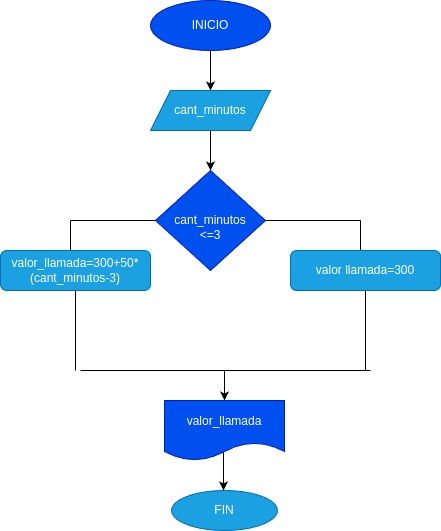

# condicionales_1
condicionales #1
## Costo dee una llamada telefonica

Ingresar el tiempo de una llamada telefonica y determinar la cantidad a pagar de acuerdo con lo siguiente:

- Toda la llamada que dure 3 minutos o menos, tiene un costo de trecientos pesos.
- Cada minuto adicional cuesta cincuenta pesos.
 